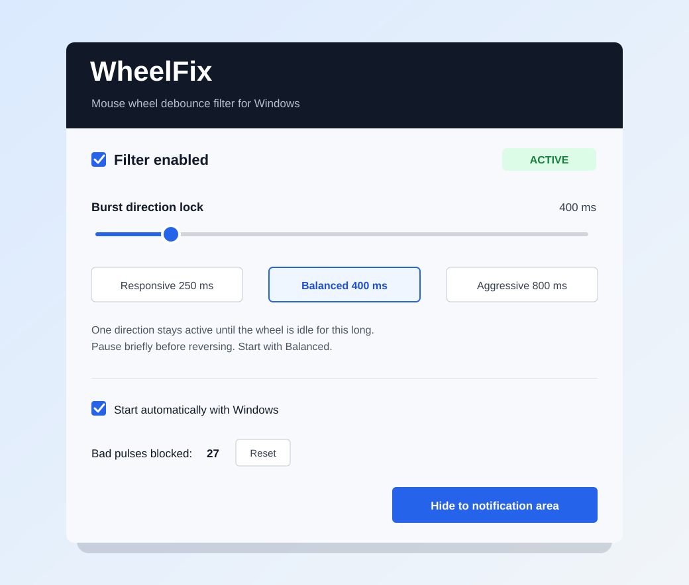

# WheelFix

[](https://github.com/SKU-1zx/WheelFix/actions/workflows/ci.yml)
[](LICENSE)

**Un filtro anti-rimbalzo leggero per la rotellina del mouse su Windows.**

> Preview sperimentale: la versione `0.3.0-preview.4` blocca ogni raffica di
> scroll sulla sua prima direzione. È calibrata per un encoder molto danneggiato
> e registra temporaneamente ogni decisione sulla rotellina verticale.

[English](README.md)



Quando un encoder meccanico si usura può inviare brevi impulsi nella direzione
sbagliata: scorri due scatti verso il basso e la pagina torna indietro di uno.
WheelFix elimina questi impulsi contrari prima che arrivino alle normali
applicazioni Windows.

## Funzioni

- Filtro globale della rotellina verticale, senza ritardo nella direzione normale.
- Pausa di fine raffica regolabile da 200 a 1500 ms.
- Preset Rapido, Bilanciato e Aggressivo.
- Contatore degli impulsi errati bloccati.
- Controlli nella tray e avvio facoltativo con Windows.
- Log diagnostico locale, apribile direttamente dal menu della tray.
- Interfaccia automatica italiano/inglese in base alla lingua di Windows.
- Nessun installer, driver, telemetria, rete o privilegio amministrativo.
- Nessun input sintetico: gli eventi accettati restano quelli originali del mouse.

## Download e avvio

1. Scarica lo ZIP Windows più recente da
   [Releases](https://github.com/SKU-1zx/WheelFix/releases/latest).
2. Estrailo in una cartella stabile.
3. Avvia `WheelFix.exe`.
4. Parti da **Bilanciato (800 ms)** e usa normalmente la rotellina.

Chiudendo la finestra WheelFix resta attivo nell'area di notifica. Con il tasto
destro sull'icona puoi mettere in pausa il filtro, cambiare intensità, attivare
l'avvio automatico, aprire il log diagnostico o uscire.

## Regolazione

| Preset | Pausa | Quando usarlo |
| --- | ---: | --- |
| Rapido | 400 ms | Inversioni volontarie più rapide, filtro più debole |
| Bilanciato | 800 ms | Consigliato per l'encoder analizzato nei log |
| Aggressivo | 1200 ms | Errori più lunghi, inversioni volontarie più lente |

Una raffica mantiene la direzione del primo evento finché non arrivano eventi
per la pausa selezionata. Per invertire direzione, ferma brevemente la
rotellina. Una pausa maggiore blocca errori più lunghi ma rallenta l'inversione.

Il contatore **Impulsi errati bloccati** conferma se il filtro sta intervenendo.
Se aumenta mentre il salto indesiderato sparisce, l'impostazione è corretta.

## Come funziona

WheelFix installa un normale hook utente `WH_MOUSE_LL` e osserva soltanto i
messaggi della rotellina verticale. Il primo evento dopo una pausa avvia una
raffica: gli eventi in quella direzione passano subito e tutti quelli contrari
vengono bloccati.

Movimento, pulsanti, scorrimento orizzontale ed eventi iniettati da altri
software non vengono toccati. WheelFix non usa mai `SendInput`.

## Log diagnostico

Scegli **Apri log diagnostico** dal menu della tray per aprire:

`%LOCALAPPDATA%\WheelFix\WheelFix.log`

La release pubblica registra avvio e arresto di WheelFix, stato dell'hook,
modifiche alle impostazioni, errori e conteggi raggruppati degli impulsi
bloccati. Questa preview sperimentale registra anche ogni delta verticale e la
decisione del filtro. Continua a **non** registrare movimenti del mouse, clic o
nomi delle applicazioni e nulla viene inviato in rete. Il file viene azzerato
automaticamente prima di superare 1 MB.

## Limiti

- Applicazioni e giochi che leggono direttamente il dispositivo tramite Raw
  Input possono saltare un hook Windows in modalità utente.
- WheelFix riduce i sintomi del rimbalzo, ma non ripara fisicamente l'encoder.
- Una vera inversione viene accettata solo dopo la pausa configurata.
- La versione attuale filtra soltanto la rotellina verticale.
- L'eseguibile non è firmato digitalmente, quindi Windows può mostrare un
  avviso di reputazione al primo avvio.

Un driver kernel coprirebbe più percorsi di input, ma richiederebbe
installazione, elevazione e firma. È volutamente fuori dallo scopo di questa
piccola utility portatile.

## Compilazione dai sorgenti

Su Windows 10/11 con .NET Framework 4.x:

```bat
build-and-run.cmd
```

Viene usato il compilatore C# già incluso in .NET Framework e l'eseguibile viene
creato in `dist\WheelFix.exe`. Non servono pacchetti NuGet o download.

La repository include anche `WheelFix.csproj`, compatibile con .NET Framework
4.8 e apribile direttamente con Visual Studio o MSBuild.

Per eseguire i test indipendenti del motore:

```bat
test.cmd
```

## Avvio automatico e rimozione

L'opzione **Avvia automaticamente con Windows** scrive un solo valore nella
chiave dell'utente corrente
`HKCU\Software\Microsoft\Windows\CurrentVersion\Run`. Le preferenze sono
salvate in `HKCU\Software\WheelFix`.

Per rimuovere WheelFix, disattiva l'avvio automatico, scegli **Esci** dalla tray
ed elimina la cartella. Se vuoi rimuovere anche il log diagnostico, elimina
`%LOCALAPPDATA%\WheelFix`.

## Contributi

Una segnalazione è particolarmente utile se include modello del mouse, versione
di Windows, applicazione interessata e finestra minima che risolve il problema.
Il flusso di sviluppo è descritto in [CONTRIBUTING.md](CONTRIBUTING.md).

## Licenza

[MIT](LICENSE) © 2026 SKU-1zx.
